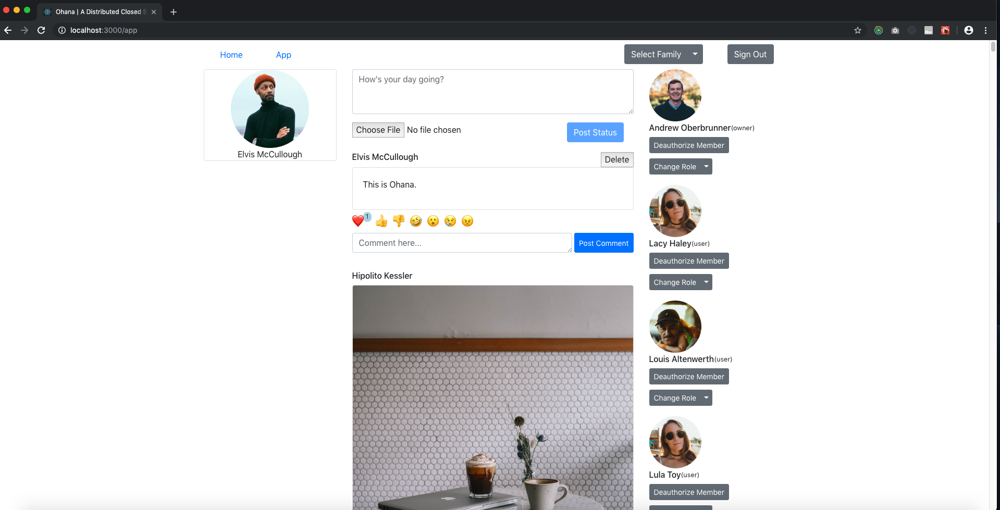

# kaiaulu
Kaiaulu is the [front-end application for hale](https://github.com/ohanaOSS/hale) and apart of OhanaOSS, together they're helping make privacy for families more accessible as a distributed social network.

This application is in Alpha as we expand into the various features already built out in the latest major release of OhanaOSS hale.

## How To Deploy
This project uses Facebook's Create-React-App as a baseplate and has [extensive docs on deploying](https://facebook.github.io/create-react-app/docs/deployment) just about anywhere. This application is designed as a standalone "portal" that connects to [hale servers](https://github.com/ohanaOSS/hale). This application connects to hale servers by storing a base url directed to where your server is located (i.e. example.com/).

## Terms of use
This is free software, view the [License](https://github.com/OhanaOSS/kaiaulu/blob/master/LICENSE) for specifics.

## Contribution Guidelines
Currently, any help is appreciated! If you have a question or bug submission, please [open an issue](https://github.com/OhanaOSS/kaiaulu/issues/new).

If you'd like to contribute code, open up an [open an issue](https://github.com/OhanaOSS/kaiaulu/issues/new) or claim [an existing enhancement](https://github.com/OhanaOSS/kaiaulu/labels/enhancement) or [bug](https://github.com/OhanaOSS/kaiaulu/labels/bug). In time, ["help wanted"](https://github.com/OhanaOSS/kaiaulu/labels/help%20wanted) and ["good first issue"](https://github.com/OhanaOSS/kaiaulu/labels/good%20first%20issue) issues will become available as I have time to parse features; These all serve as first-come, first-serve, however if you claim an issue and are absent or disappear your claimed issue may be assigned to another contributor.

# Road Map
## Next Release
1. Directory views and profiles for users
2. Local Storage of tokens and cookies to avoid sign in fatigue
3. Expand Test Suite

## Following Releases
1. Recipes
2. Events
